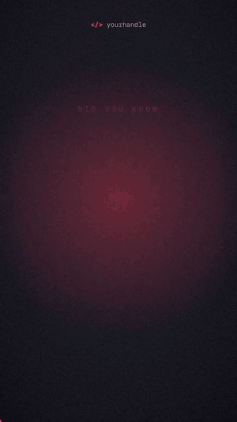

# voiceover-video

**A Claude Code skill that turns a voice recording into a fully edited, animated short video.**

Drop in a voice note. Claude transcribes it word by word, designs a shot list, finds images, builds
every scene as kinetic typography and motion graphics timed to your words, adds sound design and a
music bed that ducks under your voice, and renders a 1080×1920 Short.



No stock templates, no subscription editor, no uploads: transcription, rendering and audio all run on
your machine.

---

## What you get

- **Word-level captions** with a highlight box that follows the word being spoken
- **A new shot every 1–4 seconds**, cut on the word, not the sentence
- **Kinetic typography**: slams, highlight boxes, strike-throughs, stacked slogans, counters
- **Scene blocks**: terminals typing, stamps, VHS and CRT era looks, diagrams with flowing packets,
  charts, photo tape-ins, logo walls, montages
- **Camera moves**: whips, punch-in zooms, micro-shake on hits
- **Sound design**: 10 synthesized cue types (hits, whooshes, typing, ticks, risers…) placed by the
  timeline itself
- **A music bed** that ducks automatically under the voice and drops out before the final line
- **Film finish**: grain, vignette, loudness normalised to −14 LUFS
- **Optional face-cam bookends**: film the script on your phone in one take; your opening line and
  sign-off stay on camera and everything between is animated
- **QA gates**: Claude reviews a contact sheet of every shot before the full render, and checks the
  encoded file, not just the preview

## How it works

```
voice.mp4
  │  transcribe.py        faster-whisper, local, word timestamps
  ▼
transcript.txt ── you proofread ──► build_captions.py
  │
  ▼  Claude writes a shot list  ──► you approve it
  │
  ▼  fill_template.py + Claude authors the scenes (HTML + GSAP)
  │
  ▼  render.js stills → contact-sheet.sh → Claude reviews, fixes, repeats
  │
  ├─► render.js cues → synth_audio.py      sfx.wav + music.wav
  └─► render-frames.sh                     headless Chromium, frame-exact
          │
          ▼  mix-encode.sh                  voice + ducked music + SFX → mp4
```

Every frame is rendered by seeking a paused timeline to an exact timestamp, so the same composition
always produces the same video, however slow the machine.

---

## Install

### Requirements

| | |
|---|---|
| [Claude Code](https://claude.com/claude-code) | the agent that runs the skill |
| Node 18+ | frame rendering |
| Python 3.10+ with `faster-whisper` and `numpy` | transcription and sound synthesis |
| FFmpeg | mixing and encoding |

Runs on macOS and Linux. On Windows, run Claude Code inside WSL: the scripts are bash.

```bash
pip install faster-whisper numpy
# macOS: brew install ffmpeg node   ·   Debian/Ubuntu: sudo apt install ffmpeg nodejs npm
```

### Add the skill

**As a plugin** (recommended), inside Claude Code:

```
/plugin marketplace add Dancan254/voiceover-video-skill
/plugin install voiceover-video@voiceover-video-skill
```

**Or copy it** into your personal skills:

```bash
git clone https://github.com/Dancan254/voiceover-video-skill
cp -r voiceover-video-skill/skills/voiceover-video ~/.claude/skills/
```

### One-time setup

Nothing to run by hand: Claude runs `setup.sh` the first time you use the skill. It installs
`playwright-core` and its Chromium build, and downloads GSAP and the fonts. It prints `ready` or names
exactly what is missing.

If you copied the skill instead of installing the plugin, you can run it yourself first:

```bash
bash ~/.claude/skills/voiceover-video/scripts/setup.sh
```

---

## Use it

In Claude Code:

> make a video out of ~/Downloads/voice-note.m4a

Claude will tell you the transcription estimate, show you the shot list for approval, and hand you the
finished file with image credits and anything it could not verify.

Want to be on camera? Film yourself saying the script on your phone in one take and pass the video:

> make a video out of ~/Movies/take-1.mp4 with my face on the first and last line

Your opening line and sign-off stay on camera, and everything between is animated over the same take.
Record in SDR, not HDR, or the face shots come out washed out.

Useful follow-ups:

> make the intro punchier · use my music track ~/Music/bed.mp3 · render a landscape version

---

## Use it with another agent

Nothing here is tied to one model. `skills/voiceover-video/SKILL.md` is a plain workflow document, and
the scripts are Python, Node and bash that call no model at all. Any agent that can run shell commands
and write files can follow it:

```bash
git clone https://github.com/Dancan254/voiceover-video-skill
bash voiceover-video-skill/skills/voiceover-video/scripts/setup.sh
```

Then point your agent at `SKILL.md` and give it the audio file. Claude Code users get the same thing
through `/plugin install`, which only saves the cloning.

**What the agent needs:** a shell, file writing, and the ability to read text output. Vision is
optional and only improves Step 7: an agent that cannot see images runs `render.js check`, which
measures every shot and reports problems as text, then asks you to glance at the contact sheet. No step
needs audio, so every agent has to ask you to listen to the mix before posting.

## Make it yours

The first time you use the skill, Claude asks for your handle, your colours (a named look or your own
accent and background), your fonts and where videos should go, then writes the brand file for you. Every
question has a default, so "just use the defaults" is a valid answer. Skip it and your video carries the
example brand's `@yourhandle`.

To set it up yourself instead, write `~/.config/voiceover-video/brand.json` directly:

```bash
python3 ~/.claude/skills/voiceover-video/scripts/init_brand.py --handle @yourhandle --preset carbon-cyan
```

```json
{
  "handle": "@yourhandle",
  "colors": { "bg": "#0f0f17", "accent": "#ff3d5a", "...": "..." },
  "fonts": {
    "heading": "Archivo",
    "mono": "Geist Mono",
    "googleFontsUrl": "https://fonts.googleapis.com/css2?family=Archivo:wdth,wght@62..125,100..900&family=Geist+Mono:wght@400..700&display=swap"
  },
  "output": { "dir": "~/voiceover-videos" }
}
```

Any Google Font works. After changing fonts, ask Claude to re-run the skill's setup. A `./brand.json` in the current
directory overrides the global one, so each project can have its own look.

The default type is **Archivo** — expanded black for headlines, condensed for captions — with
**Geist Mono** for code.

---

## Good to know

- **Claude cannot hear the result.** Loudness is measured, taste is not. Listen before you post.
- **Render time.** Roughly 3 minutes of frame rendering for a 108-second Short on 10 CPU workers,
  plus transcription at 2–3x realtime.
- **File size.** Film grain resists compression; the encoder caps the bitrate so a 108-second vertical
  lands around 110 MB. Platforms re-compress anyway.
- **Images and logos** found during an edit keep their own licences. See [THIRD_PARTY.md](THIRD_PARTY.md).

## Contributing

Issues and pull requests are welcome — see [CONTRIBUTING.md](CONTRIBUTING.md). Working on the repo
with an AI agent? Point it at [AGENTS.md](AGENTS.md).

## Licence

MIT for this repository. Downloaded tools, fonts, and assets keep their own licences — see
[THIRD_PARTY.md](THIRD_PARTY.md).
